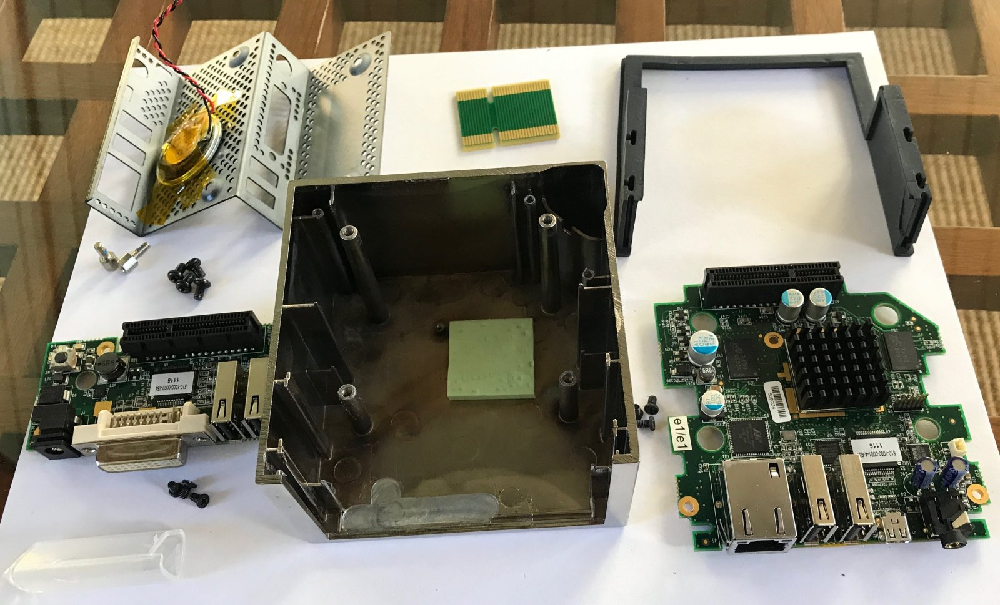

# Pano Logic Zero Client G2 

## Introduction

This project contains the reverse engineering results of the Pano Logic Zero Client G2.

It was started by [cyrozap](https://github.com/cyrozap/Pano-Logic-Zero-Client-G2-FPGA-Demo), who
did all the hard work of figuring out connections between the FPGA and peripheral ICs. Some of this work
can also be found on [his wiki page](https://pano-wiki.cyrozap.com/wiki:g2_zero_client), though 
this GitHub repo should now all have that information as well.

The Pano Logic G2 is the successor of the [Pano Logic G1](https://github.com/tomverbeure/panologic). Like the
G1, it has all the interfaces that are needed to build a small mini-computer with an FPGA.

Compared to the G1, the most important improvements of G2 are:

* Much larger FPGA: a [Xilinx Spartan-6 XC6SLX150](https://www.xilinx.com/support/documentation/data_sheets/ds160.pdf) instead 
  of a Xilinx Spartan-3E XC3S1600E.

    This is one of the largest Spartan-6 devices, with 147k logic cells, 1.3Mbit of distributed RAM, 4.8Mbit of block RAM
    and 180 DSPs. A huge upgrade compared to the 33k logic cells, 231kbit of block RAM and 36 multipliers of the G1 FPGA!
    
    For the longest time, this device was not supported by the free Xilinx ISE 14.7, and it's still not supported
    by that Linux version. However, there is now an ISE 14.7 for Win10 version that not only supports Spartan-6,
    but it supports the larger devices such as the LX150 as well!

* 256MByte of DDR2 SDRAM instead of 32MByte of LPDDR SDRAM.

* 128Mbit serial flash instead of 8Mbit.

* DVI instead of VGA output

    The Chrontel chip that drives the DVI part also supports VGA, and these VGA pins are connected to the
    analog DVI pins. So VGA is still supported with a simple, passive DVI-to-VGA adapter.

* Micro-HDMI output

* Gigabit Ethernet 

## Disassembly

Overly detailed disassembly pictures can be found [here](https://tomverbeure.github.io/pano/logic/2018/12/02/Pano-Logic-G2-Disassembly.html).

## JTAG

Instructions on how to get the JTAG going are [here](https://tomverbeure.github.io/pano/logic/2018/12/03/Pano-logic-JTAG-First-Contact.html).

## FPGA Connections

  See the [Pano.ucf](Pano.ucf) file for all the FPGA connections.

  These were all reverse engineered by cyrozap.

## Resources

* Xilinx Spartan-6 XC6SLX150 FGG484 (Speed Grade 2)

  Features:

  * 147K logic cells
  * 23K slices (4 6-input LUTs per slice, 8 FFs per slice)
  * 184K FFs
  * 1355Kbit max distributed RAM
  * 4824Kbit max block RAM (268 RAMs)
  * 180 DSPs (1 18x18 multiplier + pre-addr + accumulator)
  * 6 CMTs (2 DCMs and 1 PLL per CMT)
  * 4 memory controllers (2 used for the DDR2 SDRAM)

  Documents: 

  * [Spartan-6 Family Overview](https://www.xilinx.com/support/documentation/data_sheets/ds160.pdf)
  * [LX150-FGG484 Pin List](https://www.xilinx.com/support/documentation/user_guides/ug385.pdf#page=121)
  * [LX150-FGG484 Package Pinout](https://www.xilinx.com/support/documentation/user_guides/ug385.pdf#page=298)
  * [Spartan-6 FPGA Data Sheet: DC and Switching Characteristics](https://www.xilinx.com/support/documentation/data_sheets/ds162.pdf)
  * [Spartan-6 FPGA Configuration User Guide](https://www.xilinx.com/support/documentation/user_guides/ug380.pdf)
  * [Spartan-6 FPGA DSP48A1 Slice User Guide](https://www.xilinx.com/support/documentation/user_guides/ug389.pdf)
  * [Spartan-6 FPGA Memory Controller User Guide](https://www.xilinx.com/support/documentation/user_guides/ug388.pdf)

* 2x [Micron MT47H32M16NF-25E](https://www.micron.com/parts/dram/ddr2-sdram/mt47h32m16nf-25e?pc=%7B4064C2CD-AB47-4DB0-AB9A-A91579FD303A%7D) DDR2 SDRAM

  That's right: there are 2 SDRAM chips on this board! Each one has 512Mbit in x16 configuration, good for 128MByte per DRAM and 256MByte total.

  Theoretical peak BW is 3.2GByte/s, which is pretty decent.
  
  1920x1200x24@60 requires an average BW of only 3.3 Gbit/s, or 6.6Gbit/s with 2 screen attached. So there's definitely
  way more BW available than strictly needed.
    
* Wolfson WM8750BG Audio Codec

* 2x [Chrontel CH7301C-TF](http://www.chrontel.com/product/detail/38#) DVI Transmitter

    Supports pixel clocks up to 165MHz, which corresponds to 1920x1200x60 (with reduced blanking.) Also supports
    analog VGA output. Built-in conversion from YUV to RGB.
    
    Since HDMI is a superset of DVI, the same chip is also used for HDMI, without support for audio.
    
    There is no support for HDCP.
    
    These chips have an I2C slave interface to access configuration and status registers. After bootup, the
    chips are in power down mode, so you always need an I2C master of some sort to make video work.

* Marvell 88E1119R-NNW2 

    While there is no exact datasheet for this chips, there are a number on the web that are of the same product
    family with a close feature match.
    
    [This datasheet of the 1111](https://www.mikrocontroller.net/attachment/139158/88E1111_DS.pdf) is the closest.
    Both the 1111 and then 1119R have a regular GMII interface. Since GMII is a standard, it should be possible to 
    get this working without. 
    
    [Feature Comparison sheet](http://static6.arrow.com/aropdfconversion/80d635a18100a0f0c187b633911ff93001715194/ethernetphypsg_v2_ndafr002.pdf) 
    of all components in the same product series. The 1119R is the only one that still supports the original
    MII interface.
    
    [Some driver code](https://github.com/tardfs/frontend/blob/master/ethertest/xapp1042/marvell_88e1111.c)
    for this Ethernet PHY family.
    
    [More driver code](https://github.com/Undrizzle/apps/blob/master/DSDT_3.0/phy/) that supports 88E1119R directly 
    and highlights the differences with 88E111.

* [Micron M25P128 Serial Flash with SPI](https://www.micron.com/~/media/documents/products/data-sheet/nor-flash/serial-nor/m25p/m25p_128.pdf)

    128Mbit or 32MByte. 54MHz.

    Marked as 25P28V6G. Which translates to M25P128 with [this code translator](https://www.micron.com/~/media/Documents/Products/Technical%20Note/NOR%20Flash/tn1224_spi_marking.pdf).

*  [SMSC 3300-EKZ](https://www.microchip.com/wwwproducts/en/USB3300) USB ULPI to USB PHY Transceiver

    ULPI is parallel replacement for the serial USB protocol that's typically used to provide USB PHY
    capabilities to chips that don't have built-in USB PHY, such a FPGAs.
    
    It's still up to the FPGA to implement a full USB host controller. This is contrary to the Pano
    Logic G1, which has a USB chip that includes both controller and PHY.

* [SMSC USB2514HZH USB 4-Port Hub Controller](https://www.microchip.com/wwwproducts/en/USB2514)

    This chip has sensible zero-configuration power-up settings to operate as a 4-port hub. Right now,
    there don't seem to be any connections between the FPGA and this chip, so it's likely configured
    in this mode. If so, that's great: it's at least one less chip to get up and running.

* [TI LM339](http://www.ti.com/product/LM339) Quad Differential Comparators

    Marked L339.
